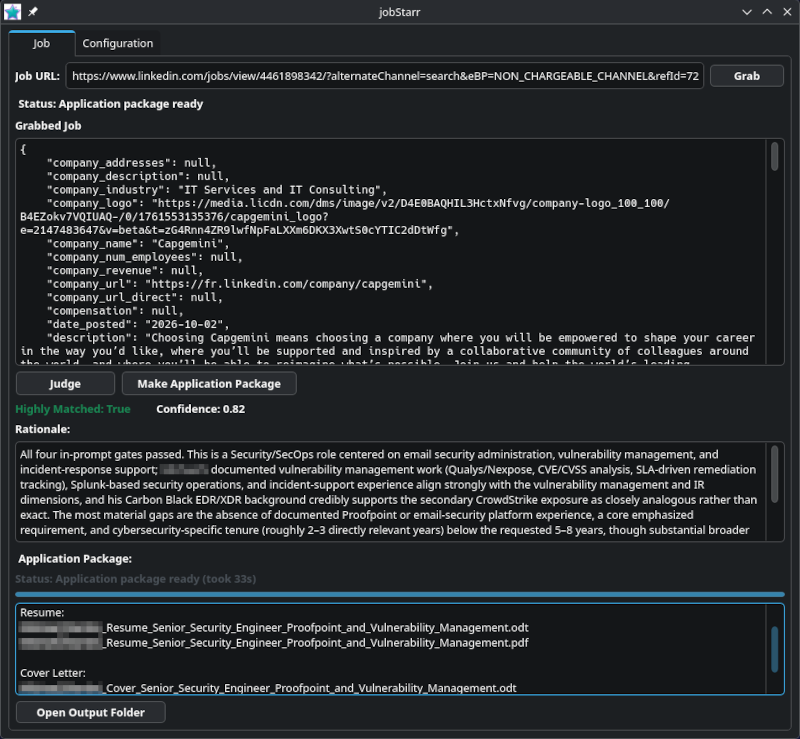

# jobStarr (`jS`) — Version 0.2.1

[](https://en.cppreference.com/w/cpp/20)
[](https://www.qt.io/)
[](https://cmake.org/)
[](https://github.com/sudoTni/jobStarr/releases/download/v0.2.1/jobStarr-Linux-v0.2.1.zip)
[](https://github.com/sudoTni/jobStarr/releases/download/v0.2.1/jobStarr-Windows-v0.2.1.zip)
[](LICENSE)<br>
[](https://antigravity.google/)
[](https://openai.com/codex/)
[](https://opencode.ai/)
[](https://openrouter.ai)

<p align="center">
  <br>
  <a href="https://github.com/sudoTni/jobStarr/releases/download/v0.2.1/jobStarr-Linux-v0.2.1.zip">Linux</a>
  |
  <a href="https://github.com/sudoTni/jobStarr/releases/download/v0.2.1/jobStarr-Windows-v0.2.1.zip">Windows</a>
</p>

---

**jobStarr** (`jS`) is a high-precision Linux & Windows desktop application engineered in **C++20** and **Qt 6 Widgets**. Built for deliberate, quality-first career management, it automates the analysis of individual **LinkedIn** and **Indeed** job postings, evaluates candidate-to-job alignment using advanced LLM reasoning without fabrication, and generates polished, customized application packages (tailored resumes and cover letters in both `.odt` and `.pdf` formats).

---

<p align="center">
  
</p>

---

> [!WARNING]
> ### Legal Disclaimer & Terms of Service Notice
> jobStarr is provided strictly for educational, research, and personal productivity purposes.
>
> Scraping job board platforms (including LinkedIn, Indeed, and others) may be subject to the respective platforms' Terms of Service, User Agreements, robots.txt directives, and applicable local laws. The developers and contributors of jobStarr:
> 1. Do not encourage, endorse, or promote unauthorized automated scraping, rate-limit evasion, or commercial extraction of proprietary data.
> 2. Assume no liability for account restrictions, IP blocks, CAPTCHA challenges, legal claims, or service suspensions resulting from the use of this software.
> 3. Urge all users to employ reasonable request throttling, respect robots.txt guidelines, and utilize official developer APIs whenever available for commercial or high-volume workflows.
>
> You are solely responsible for ensuring that your execution of jobStarr complies with all relevant terms of service, platform guidelines, and legal requirements.

---

## Table of Contents

- [1. Core Philosophy](#1-core-philosophy)
- [2. System Architecture & Workflows](#2-system-architecture--workflows)
  - [Workflow A: Job Grab & Inspection](#workflow-a-job-grab--inspection)
  - [Workflow B: Deterministic Evaluation (`Judge`)](#workflow-b-deterministic-evaluation-judge)
  - [Workflow C: End-to-End Application Generation (`Make Application Package`)](#workflow-c-end-to-end-application-generation-make-application-package)
- [3. Dual LLM Architecture](#3-dual-llm-architecture)
  - [Separation of Concerns & Privacy](#separation-of-concerns--privacy)
  - [Outbound API Headers](#outbound-api-headers)
  - [Configurable Reasoning Effort](#configurable-reasoning-effort)
- [4. ODT Templating Engine & Style Fidelity](#4-odt-templating-engine--style-fidelity)
- [5. Candidate Profile & Smart Skills Normalization](#5-candidate-profile--smart-skills-normalization)
- [6. Configuration Reference](#6-configuration-reference)
- [7. Repository Structure](#7-repository-structure)
- [8. Building & Installation](#8-building--installation)
  - [System Prerequisites](#system-prerequisites)
  - [Compilation](#compilation)
  - [Running the Test Suite](#running-the-test-suite)
  - [Launching jobStarr](#launching-jobstarr)
- [9. Output Artifacts](#9-output-artifacts)
- [10. Troubleshooting & FAQs](#10-troubleshooting--faqs)
- [11. Privacy & Security Audit](#11-privacy--security-audit)
- [12. Attribution & Acknowledgements](#12-attribution--acknowledgements)
- [13. License](#13-license)

---

## 1. Core Philosophy

Modern job hunting is plagued by automated "spray-and-pray" tools that blast generic applications to hundreds of listings, devaluing both applicant credentials and employer review. `jobStarr` takes the opposite approach:

* **Intentional & Individual**: Designed strictly for one-by-one posting evaluation. Each posting is inspected, scrutinized, and reasoned through individually.
* **Truth in Application (*Veritas*)**: The core evaluation prompt operates under strict anti-hallucination guardrails. It never invents qualifications, inflates candidate tenure, or fabricates skills.
* **100% Local & Sovereign**: Runs natively on Linux. Your resume, credentials, notes, and API keys remain stored on your local drive with restricted file permissions (`0600`). No telemetry, analytics, or third-party servers.

---

## 2. System Architecture & Workflows

```text
                  +-------------------------------+
                  |  LinkedIn / Indeed Job URL    |
                  +-------------------------------+
                                  |
                                  v
                  +-------------------------------+
                  |  Host Anchor Regex Validation |
                  +-------------------------------+
                                  |
                                  v
                  +-------------------------------+
                  |  Grab Job (Native C++ Scraper)|
                  +-------------------------------+
                                  |
                                  v
                     [ Normalized JobRecord ]
                                  |
         +------------------------+------------------------+
         |                                                 |
         v                                                 v
+------------------+                    +------------------------------------+
|      Judge       |                    |      Make Application Package      |
+------------------+                    +------------------------------------+
| Primary LLM      |                    | 1. Preflight Validation            |
| - Veritas sys    |                    | 2. Primary LLM: tailored materials |
| - {targJD}       |                    | 3. Search LLM: company address     |
| - {myResume}     |                    | 4. ODT Engine: XML style-safe subs |
+------------------+                    | 5. Headless LibreOffice PDF Engine |
         |                              | 6. Atomic Publication to output/   |
         v                              +------------------------------------+
[ Decision Verdict ]                                       |
- Highly Matched: True/False                               v
- Confidence: 0.00 - 1.00               [ 4 Published Production Artifacts ]
- Comprehensive Rationale               - Candidate_Resume_<Target>.odt
                                        - Candidate_Resume_<Target>.pdf
                                        - Candidate_Cover_<Target>.odt
                                        - Candidate_Cover_<Target>.pdf
```

### Workflow A: Job Grab & Inspection
1. **URL Sanitization**: Host-anchored regex validation verifies that the input URL originates strictly from valid `linkedin.com` or `indeed.com` domains, protecting against open redirects and arbitrary input injection.
2. **Native C++ Scraper**: Asynchronously fetches and parses the posting natively using Qt Network (`QNetworkAccessManager`), `libxml2` XPath navigation for LinkedIn, and direct GraphQL querying for Indeed—eliminating external subprocesses, Python runtimes, and intermediate scripts.
3. **Structured Normalization**: Extracts metadata (title, company, description, compensation, location) and supports both plain strings and structured location dictionaries (`city`, `state`, `country`). Outputs clean, deterministic JSON directly into the editor for review.

### Workflow B: Deterministic Evaluation (`Judge`)
1. **Template Rendering**: Combines the candidate's master resume (`candidate_data/my_resume.md`) and the serialized job record into the Job Judge template (`prompts/jj_prompt.md`).
2. **Asynchronous LLM Query**: Sends the rendered prompt to the configured **Primary LLM** using `QNetworkAccessManager` with an active elapsed progress ticker.
3. **Structured Verdict Parsing**: Validates and renders the JSON response array:
   - **Match Status**: Rendered as a prominent `Highly Matched: True` (green) or `Highly Matched: False` (red) indicator.
   - **Confidence Score**: Bounded numeric confidence value ranging from `0.00` to `1.00`.
   - **Detailed Rationale**: Comprehensive, un-truncated explanation detailing qualifying criteria, alignment strengths, and missing requirements.

### Workflow C: End-to-End Application Generation (`Make Application Package`)
Operates completely independently from `Judge`—usable directly on any grabbed job:
1. **Preflight Validation**: Before consuming LLM tokens, validates the configuration, template accessibility, required placeholders, write permissions, and LibreOffice availability.
2. **Tailored Material Generation (Primary LLM)**: Renders `prompts/mm_prompt.md` with normalized candidate credentials and queries the Primary LLM to produce 6 Markdown sections:
   - `### Custom Professional Title`
   - `### Custom Professional Summary`
   - `### Custom Key Skills`
   - `### Tailored Cover Letter Body`
   - `### Rationale`
   - `### Result Basename` (e.g. `Candidate_Resume_Senior_IT_Security_Specialist`)
3. **Company Address Lookup (Search LLM)**: Queries the Search LLM with employer facts (company name, title, location, URLs) to retrieve the physical or corporate mailing address. **Candidate credentials are never sent to the search service.**
4. **ODT Template Rendering (`libzip`)**: Copies templates to a UUID-isolated staging directory (`output/.jobstarr-tmp-<uuid>`), extracts `content.xml`, substitutes placeholders with XML-escaped content, and injects cover letter paragraphs preserving enclosing paragraph styles.
5. **Headless PDF Conversion**: Converts `.odt` files to `.pdf` via headless LibreOffice (`libreoffice --headless --convert-to pdf`).
6. **Transactional Publication**: Verifies that all 4 artifacts exist and are non-empty before atomically publishing them into `./jobStarr-cpp/output`.
7. **Desktop Integration**: Provides an "Open Output Folder" action using `QDesktopServices` to instantly reveal the files in the Linux file manager.

---

## 3. Dual LLM Architecture

### Separation of Concerns & Privacy
`jobStarr` enforces a strict architectural boundary between candidate-facing generation and web-facing address retrieval:

| Characteristic | Primary LLM | Search LLM |
| :--- | :--- | :--- |
| **Config Section** | `Primary LLM` | `Search LLM` |
| **Primary Tasks** | Job fit evaluation (`Judge`) & tailored material generation (`mm_prompt.md`) | Real-time employer mailing/street address discovery |
| **Candidate Data Sent** | **Yes** (Master resume, professional summary, normalized skills, testimonials) | **None** (Strictly company name, job title, location, and URLs) |
| **Recommended Models** | High-reasoning models (e.g., `openai/gpt-4o`, `anthropic/claude-3.5-sonnet`, `openai/o3-mini`, `openai/gpt-5.4`) | Web-connected search models (e.g., `perplexity/sonar`, `google/gemini-2.0-flash`, `google/gemini-3.1-flash-lite`) |
| **Reasoning Effort** | Configurable (`low`, `medium`, `high`, or omitted) | Configurable (`low`, `medium`, `high`, or omitted) |
| **Default Timeout** | 300 seconds | 300 seconds |

### Outbound API Headers
All HTTP requests sent to OpenRouter or OpenAI-compatible endpoints include identification headers:
```http
HTTP-Referer: https://github.com/sudoTni/jobStarr
X-Title: jobStarr
```

### Configurable Reasoning Effort
For frontier reasoning models, `jobStarr` provides dedicated **Reasoning Effort** inputs in both LLM configuration panels:
- When populated with `low`, `medium`, or `high`, `jobStarr` adds `"reasoning_effort": "<value>"` to the request JSON payload.
- When left blank, the key is omitted entirely, guaranteeing full backward compatibility with non-reasoning models (preventing HTTP 400 Bad Request errors).

---

## 4. ODT Templating Engine & Style Fidelity

Application packages are generated from native OpenDocument (`.odt`) files rather than fragile HTML-to-PDF converters.

### Template Placeholders
`jobStarr` substitutes the following placeholders in your `.odt` templates:

#### Resume Template (`Candidate_Resume000-TEMPLATE.odt`):
- `{{custom_prof_title}}`: Tailored professional headline.
- `{{custom_prof_summary}}`: Tailored multiline summary.
- `{{custom_skills}}`: Prioritized, JD-relevant skills formatted as bullet points.

#### Cover Letter Template (`Candidate_Cover000-TEMPLATE.odt`):
- `{{custom_prof_title}}`: Tailored professional headline.
- `{{todays_date}}`: Formatted current date (e.g. `October 4, 2026`).
- `{{job_company_address}}`: Discovered physical mailing address.
- `{{job_company}}`: Employer name.
- `{{cover_body}}`: Tailored multi-paragraph body.

### Dynamic XML Paragraph Styling & Single-Page Guarantee
LibreOffice templates often assign unique master-page and page-break attributes to paragraph styles (e.g., `P1`). Rather than hardcoding generic paragraph tags, `jobStarr` dynamically inspects the enclosing XML container of `{{cover_body}}` and reuses its exact style attributes (e.g. `<text:p text:style-name="P3">`). This ensures that generated cover letters fit cleanly onto **a single page** without accidental page breaks between paragraphs.

---

## 5. Candidate Profile & Smart Skills Normalization

The **Configuration** tab manages the candidate's professional baseline:
- **Professional Title**: Default target headline (e.g., `Senior Systems & Security Engineer`).
- **Professional Summary**: Foundational summary statement.
- **Master Resume**: Comprehensive Markdown resume containing full employment history, education, and credentials.
- **Testimonials**: Optional colleague recommendations and endorsements. If omitted, `{myTestimonials}` renders cleanly as an empty string.
- **Key Skills & Intelligent Normalization**: Paste your skills in any format (comma-separated, newline-separated, or bulleted with `*`, `-`, `+`). When compiling `{myKeySkills}`, `jobStarr`:
  1. Strips leading Markdown bullets and list decorators.
  2. Trims extraneous whitespace.
  3. Deduplicates entries case-insensitively while preserving original casing.
  4. Sorts entries alphabetically for consistent evaluation.

> [!TIP]
> **Personalizing for Your Job Search**
> The files provided in `candidate_data/` and `templates/` serve as a coherent, realistic synthetic example centered on an imaginary candidate profile (`Candidate`). When personalizing `jobStarr` for your own job search, we officially recommend customizing the supplied example data—including `candidate_data/my_resume.md`, `candidate_data/my_testimonials.md`, and the prompt files—with the assistance of an AI chatbot (such as ChatGPT, Claude, or Gemini) and/or an AI coding assistant.


---

## 6. Configuration Reference

All settings are persisted in `jobStarr.yaml` located in the application working directory. The file is written with strict user-only POSIX permissions (`0600` / `-rw-------`):

```yaml
# jobStarr Configuration File (v0.2.1)
version: "0.2.1"

api:
  primary:
    endpoint: "https://openrouter.ai/api/v1/chat/completions"
    model: "openai/gpt-4o"
    api_key: "sk-or-v1-..."      # never commit a real key; this file is mode 0600
    reasoning_effort: "high"     # Optional: "low", "medium", "high", or ""
    timeout_seconds: 300
  search:
    endpoint: "https://openrouter.ai/api/v1/chat/completions"
    model: "perplexity/sonar"
    api_key: "sk-or-v1-..."
    reasoning_effort: ""         # Optional
    timeout_seconds: 300

prompts:
  system: "..."                  # defaults to sysprompts/veritas_sys_prompt.md
  job_judge: "..."               # defaults to prompts/jj_prompt.md
  make_materials: "..."          # defaults to prompts/mm_prompt.md

candidate:
  professional_title: "Senior Systems & Security Engineer"
  professional_summary: "Experienced engineer with..."
  key_skills: "Splunk, Qualys, Carbon Black, Linux, Python, AWS"
  resume: "# Candidate\n\n## Experience\n..."
  testimonials: ""

materials:
  resume_template: "templates/Candidate_Resume000-TEMPLATE.odt"
  cover_letter_template: "templates/Candidate_Cover000-TEMPLATE.odt"
```

*Note: the `prompts`, `candidate`, and `materials` sections are omitted entirely on first launch and repopulated from the bundled defaults (`sysprompts/`, `prompts/`, `candidate_data/`, `templates/`) via the Qt resource bundle in `resources/jobstarr.qrc`.*

*Note: `jobStarr` automatically migrates existing v0.1.0 and v0.2.0 configurations to v0.2.1 upon launch.*

---

## 7. Repository Structure

```text
jobStarr-cpp/                           # This repository (C++20 / Qt 6 application)
├── CMakeLists.txt                      # Build configuration & test targets
├── LICENSE                             # MIT
├── .gitignore                          # Excludes output/*, jobStarr.yaml, CMake scaffolding
├── icon/
│   ├── jobStarr_icon.png                # Application icon (window + taskbar)
│   └── jobStarr_logo.png                # README / wordmark artwork
├── screenshots/                        # Full-size + reduced GUI captures
├── sysprompts/
│   └── veritas_sys_prompt.md           # Anti-hallucination system prompt
├── prompts/
│   ├── jj_prompt.md                    # Job Judge prompt template
│   └── mm_prompt.md                    # Make Materials prompt template
├── candidate_data/                     # Candidate baseline files
│   ├── my_professional_title.md
│   ├── my_professional_summary.md
│   ├── my_key_skills.md
│   ├── my_resume.md
│   └── my_testimonials.md
├── templates/                          # OpenDocument master templates
│   ├── Candidate_Resume000-TEMPLATE.odt
│   └── Candidate_Cover000-TEMPLATE.odt
├── resources/
│   └── jobstarr.qrc                    # Qt compiled resource bundle
├── third_party_licenses/               # Preserved licenses for derived components
│   └── LICENSE.JobSpy                  # Cullen Watson MIT license for scraping architecture
├── src/                                # C++ implementation
│   ├── main.cpp                        # Application bootstrap
│   ├── MainWindow.*                    # Primary tabbed interface
│   ├── ConfigurationWidget.*           # Configuration GUI
│   ├── ConfigManager.*                 # YAML persistence & migration
│   ├── ProjectPaths.*                  # Filesystem discovery
│   ├── JobRecord.*                     # Normalized job model
│   ├── JobJudgeResult.*                # Evaluation parser
│   ├── PromptRenderer.*                # Template substitution engine
│   ├── UrlValidator.*                  # Host regex validation
│   ├── LlmClient.*                     # Async HTTP LLM client
│   ├── CandidateProfile.*              # Profile & skill deduplicator
│   ├── CompanyAddressLookup.*          # Search LLM integration
│   ├── MakeMaterialsParser.*           # LLM material response parser
│   ├── MakeMaterialsController.*       # Application package orchestrator
│   ├── FilenameSanitizer.*             # Safe filesystem path generator
│   ├── OdtTemplateRenderer.*           # libzip ODT XML rendering engine
│   ├── PdfConverter.*                  # Headless LibreOffice PDF converter
│   ├── OutputManager.*                 # Atomic staging & publisher
│   └── scraping/                       # Native C++ LinkedIn & Indeed scrapers
│       ├── ScrapeError.h               # Structured scrape error model
│       ├── JobScraper.h                # Abstract async scraper interface
│       ├── LinkedInScraper.*           # Native LinkedIn parser (libxml2 XPath)
│       ├── IndeedScraper.*             # Native Indeed parser (GraphQL + JSON)
│       ├── JobParsingUtilities.*       # Shared date, salary & markdown utilities
│       └── ScraperFactory.*            # Factory routing URLs to native scrapers
├── tests/                              # 16 automated QTest test suites
├── output/                             # Published application packages (generated)
└── build/                              # Build tree (partially tracked — see below)
```

### Native Scraping Architecture: C++ Indeed & LinkedIn Parsers

`jobStarr` scrapes LinkedIn and Indeed postings natively in C++ using Qt Network (`QNetworkAccessManager`), `libxml2` XPath navigation for LinkedIn, and direct GraphQL querying for Indeed.

- **Zero Python Runtime**: No Python interpreter, virtual environment, or external `pip` dependencies (`requests`, `beautifulsoup4`, `pandas`, `curl_cffi`, `markdownify`) are required at build or runtime.
- **Asynchronous & Non-Blocking**: Scraper requests run directly on Qt's event loop with active timeout handling and clean cancellation semantics without freezing the user interface.
- **JobSpy Parity & Provenance**: Extraction heuristics, HTML parsing rules, and GraphQL queries are derived from and inspired by [**JobSpy**](https://github.com/speedyapply/JobSpy/) (MIT, © 2023 Cullen Watson). Full licensing obligations are preserved in `third_party_licenses/LICENSE.JobSpy`.

---

## 8. Building & Installation

### System Prerequisites

#### Arch Linux / Manjaro:
```bash
sudo pacman -S base-devel cmake qt6-base yaml-cpp libzip libxml2 libreoffice-fresh poppler
```

#### Ubuntu 22.04+ / Debian 12+:
```bash
sudo apt-get update
sudo apt-get install -y build-essential cmake qt6-base-dev qt6-base-dev-tools \
    libyaml-cpp-dev libzip-dev libxml2-dev libreoffice poppler-utils
```

#### Fedora 38+ / RHEL 9:
```bash
sudo dnf install -y gcc-c++ cmake qt6-qtbase-devel yaml-cpp-devel libzip-devel \
    libxml2-devel libreoffice poppler-utils
```

### Compilation
Build the application in Release mode:
```bash
cmake -S . -B build -DCMAKE_BUILD_TYPE=Release
cmake --build build -j$(nproc)
```

### Running the Test Suite
`jobStarr` includes 16 automated unit and boundary test suites covering URL validation, prompt rendering, LLM parsing, native scraping, HTML/GraphQL extraction, ODT rendering, PDF conversion, address lookups, and transactional staging:
```bash
ctest --test-dir build --output-on-failure
```
*Expected test summary:*
```text
100% tests passed out of 16
Total Test time (real) = ~2.0s
```

#### Committed build artifacts

`build/` is **partially tracked** so a release can be audited without a toolchain.
Tracked: the `jobStarr` executable, `libjobstarr_core.a`, and the 16 test binaries.
They were produced by a neutral-path build, so no username or private directory
layout is embedded, and they contain no credentials.

Not tracked: CMake's generated scaffolding — `CMakeCache.txt`, `Makefile`,
`CTestTestfile.cmake`, `cmake_install.cmake`, `CMakeFiles/`, `*_autogen/`, `.qt/`,
`Testing/`. These embed the absolute source and binary directories of the machine
that generated them, so committing `CMakeCache.txt` makes `cmake -S . -B build`
hard-error on any other machine.

Consequences:

* `ctest --test-dir build` needs a configure first (`cmake -S . -B build`),
  because `CTestTestfile.cmake` is not committed.
* The committed test binaries **do** run standalone, which is the quickest way to
  re-verify a checkout without rebuilding:
  ```bash
  ./build/test_config && ./build/test_odt_renderer   # etc.
  ```
  All 16 are relocatable and resolve their templates through `ProjectPaths`.
* Always rebuild after cloning to get a usable build directory:
  ```bash
  rm -rf build && cmake -S . -B build -DCMAKE_BUILD_TYPE=Release \
                 && cmake --build build -j$(nproc)
  ```

### Launching jobStarr
```bash
./build/jobStarr
```

---

## 9. Output Artifacts

Published packages are stored directly in `jobStarr-cpp/output/` with sanitized, collision-resistant filenames:

1. `Candidate_Resume_<Sanitized_Role>.odt`
2. `Candidate_Resume_<Sanitized_Role>.pdf`
3. `Candidate_Cover_<Sanitized_Role>.odt`
4. `Candidate_Cover_<Sanitized_Role>.pdf`

*Example:*
- `Candidate_Resume_Senior_IT_Security_Specialist.pdf` (2 pages, tailored bullet points, custom headline and summary)
- `Candidate_Cover_Senior_IT_Security_Specialist.pdf` (1 page, company address, tailored body, matching typography)

---

## 10. Troubleshooting & FAQs

### Q: "Grab" fails or request times out.
**A**: Ensure your Internet connection is active and that the URL is a public posting. LinkedIn and Indeed may apply rate limits or CAPTCHA challenges to IP addresses generating excessive automated traffic. If a request times out, check your network and retry after a brief pause.

### Q: LibreOffice conversion fails during package generation.
**A**: Ensure `libreoffice` or `soffice` is installed and reachable in your system `$PATH`:
```bash
which libreoffice
libreoffice --version
```
Verify headless PDF conversion manually:
```bash
libreoffice --headless --convert-to pdf test.odt
```

### Q: LLM request times out during evaluation or tailoring.
**A**: High-reasoning models (e.g. `openai/o3-mini`, `openai/gpt-5.4`) require additional thinking time. In the **Configuration** tab, increase the Primary LLM **Timeout (seconds)** to `300` or higher and verify your network connectivity to OpenRouter.

### Q: Why is my cover letter splitting across two pages?
**A**: Ensure that your cover letter template does not use master page styles with forced breaks on the placeholder paragraph. `jobStarr` dynamically preserves the enclosing paragraph tag (e.g., `P3`) to maintain single-page layout fidelity.

---

## 11. Privacy & Security Audit

* **Zero Secret Logging**: Bearer tokens, API keys, Authorization headers, and full candidate resumes are never output to standard logs, terminal consoles, or status messages.
* **Separation of LLM Traffic**: The Search LLM only receives prospective employer names and locations. Candidate credentials never touch search endpoints.
* **POSIX File Permissions**: Configuration files containing API keys are written with strict `0600` permissions (`-rw-------`).
* **Subprocess Security**: External process execution (`libreoffice`) is executed using discrete `QStringList` argument vectors via `QProcess`, eliminating shell injection risks. Web scraping occurs entirely natively in-process via Qt Network.

---

## 12. Attribution & Acknowledgements

### Project Attribution
- **`jobStarr` (`jS`)**: Developed and maintained by the **`jobStarr Contributors`**.

### Scraping Engine Attribution
- **Native C++ Scrapers Derived from JobSpy**: Powered by architecture derived from and inspired by the open-source [**JobSpy**](https://github.com/speedyapply/JobSpy/) engine created by Zachary Hampton, Cullen Watson, and the [speedyapply](https://github.com/speedyapply) community:
  - Repository: [https://github.com/speedyapply/JobSpy/](https://github.com/speedyapply/JobSpy/)
  - License: MIT License (Copyright &copy; 2023 Cullen Watson)
  - We gratefully acknowledge their work in engineering and maintaining high-fidelity scraping infrastructure for LinkedIn and Indeed postings.
  - The JobSpy MIT license is preserved verbatim in [`third_party_licenses/LICENSE.JobSpy`](third_party_licenses/LICENSE.JobSpy).

### Third-Party Ecosystem
- **Qt 6 Framework**: Cross-platform GUI and asynchronous networking by The Qt Company.
- **LibreOffice**: Headless OpenDocument PDF generation engine by The Document Foundation.
- **libxml2**: XML and HTML parsing and XPath query engine by Daniel Veillard and contributors.
- **yaml-cpp**: YAML parsing by Jesse Beder.
- **libzip**: Multi-platform zip archive manipulation by Dieter Baron and Thomas Klausner.

---

## 13. License

This project is licensed under the MIT License — Copyright &copy; 2026 **jobStarr Contributors**. See [LICENSE](LICENSE) for details.
